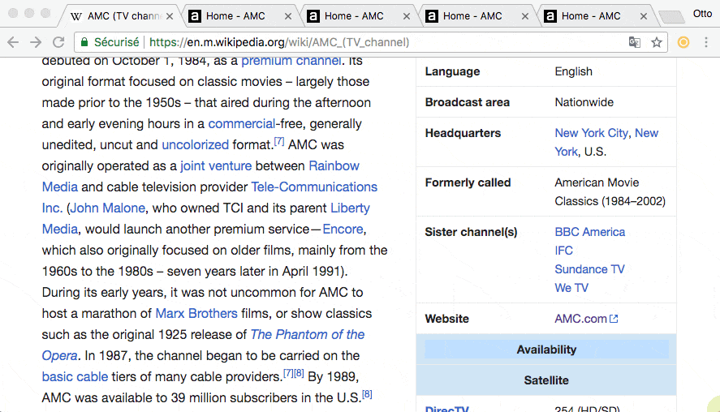

# Otto Tabs 

>Smart tabs management

As a developper I often find myself struggling with too many open tabs.  
Clicking on a link in an email or from any chat software creates each time a new tab. On top of this, add some Google, Wikipedia Github or Stack Overflow tabs and your browser looks like a mess 😤.

It needs regular manual intervention to keep a clean browser. That is why I created Otto Tabs.

## Compatibility

Otto Tabs works with all chromium based browsers that implement the [chrome.tabs api](https://developer.chrome.com/docs/extensions/reference/api/tabs).

Tested on Chrome 124.0.6367.119, Opera 109.0.5097.68, Brave 1.65.126

## Features

Those feature can be toggled on and off. By default the first two are enabled.

### Group/stack tabs automatically

Tabs from same domain are grouped next to each other.

### Remove duplicate tabs

Tabs with the same url are closed. Only last open tab is kept.

### Remove older tabs

No more than 5 tabs from the same domain are open at the same time.

## Feedback

Feel free to fill a ticket [here](https://github.com/Benlenem/chrome-otto-tabs/issues) !

## Want to build and install the extension yourself ?

* Install [yarn](https://classic.yarnpkg.com/en/docs/install/)
* Download or clone the project
* Using a terminal go to the project root folder
* Type `yarn archive`. This will execute the unit tests and create a `build` folder. This folder contains all the extension files.
* Go to either [chrome://extensions](chrome://extensions), [opera://extensions](opera://extensions) or [brave://extensions](brave://extensions) according to your browser
* Install the extension as unpacked by selecting the `build` folder
dz
